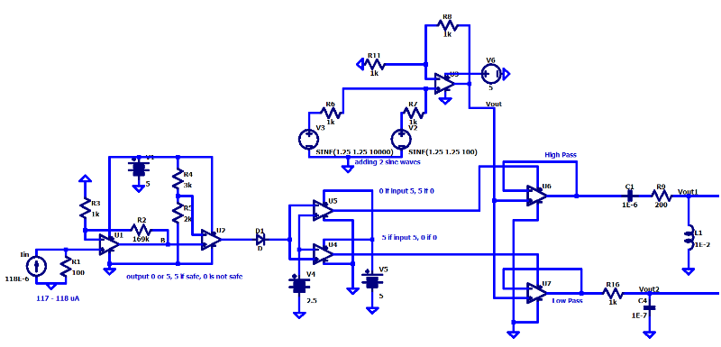
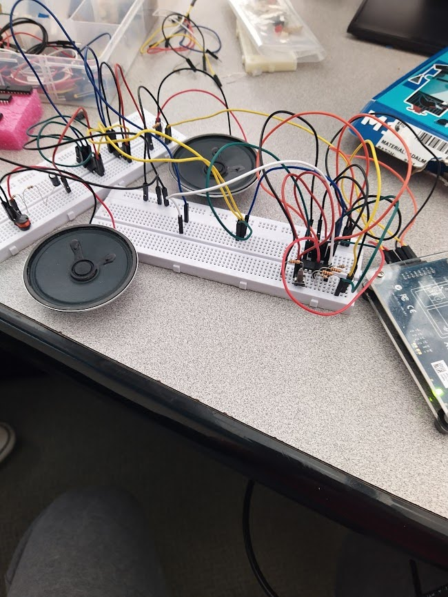

# Oxygen Sensor

Contributors: Andrew Bank, Karim Abouzeid, Wenxuan Xie

## Overview

Using the SGX-40X, we designed a circuit that would alarm those that are in a dangerously low oxygen supply. This schematic uses a combination of precision operational amplifiers, inductors, capacitors, and resistors in order to elicit an LED and audio output to alert those around to leave the area.

Working on a team of 3, we had worked on this project to create a circuit takes in the oxygen level and powers an LED, lighting it up if we deem that it is a safe oxygen level for humans, and we don’t light it up if we deem that it is a dangerous oxygen level for humans. Also, when the oxygen level is within a safe range, the sensor sends a signal to a speaker to play a high-frequency sound. This sound indicates that the oxygen level is safe and within a desired threshold. Conversely, when the oxygen level falls below the safe threshold, the oxygen sensor sends a signal to the speaker to play a low-frequency sound. This sound indicates that the oxygen level is unsafe and requires attention. Thus, these differing frequencies indicate safe and unsafe oxygen levels to provide a clear way to communicate oxygen levels without requiring any special knowledge or training.

## Pre-existing Applications

Oxygen sensors are currently used in combustion engines and are used to regulate the air-fuel ratio in order for the amount of fuel injected into the engine to adjust for extra air or fuel. This can then control the amount of emissions that the vehicle outputs, which can be harmful to humans and the earth alike.
They are also used in respiratory systems for divers, which measures the oxygen concentration of breathing a mixture of gasses, where divers must monitor their oxygen content in their supplied gasses. If there is too little oxygen for the divers, it can become dangerous for the divers to stay underwater and to respirate the little oxygen that the human body very much needs.
We also need to regulate respiratory systems for hospitals for patients to not have a dangerous amount of oxygen, as a low amount of oxygen can be harmful for those that cannot breath on their own, but also a high amount of oxygen can be harmful also, so we must regulate the amount that people are breathing when people are sickly and cannot regulate or take in as much oxygen as they need.
In soil respiration, oxygen sensors are used to find how oxygen is depleted over time to predict soil respiration rates. This then can be used to estimate how much oxygen and carbon dioxide is produced through photosynthesis and living creatures in the soil. This cycle of carbon dioxide and oxygen inside the soil is representative in global carbon cycling, or in other words how the carbon cycle plays a part on our earth.
They can also be used to monitor the fire risk in a protected space, where oxygen is very flammable,thus it can be very risky for a large amount of oxygen to be put into one space that can be prone to sparks or fire. Thus, we can use an oxygen sensor to regulate and minimize this risk. 
Oxygen sensors are used in a variety of industrial processes, including fermentation, welding, and metal cutting, to monitor and control the oxygen levels for optimal performance and safety for their workers.

## How it Works

This project can be broken down into operational amplifiers that can be classified as non-inverting amplifiers, comparators, voltage followers that act as switches, adders. They work in tandem with low pass and bandpass filters that utilize just capacitors, inductors, and resistors. 

[A more mathmatical explanation!](https://docs.google.com/document/d/11dKiXr9g6kT0yFc9-63gz_o0bKVgVQtB5aEgaVRr5AQ/edit?usp=sharing)

## Operating Conditions

### Limitations of the Circuit

* The oxygen sensor can’t sense over 25% oxygen accurately.
* The oxygen sensor is inaccurate in an abnormally large presence of carbon dioxide and sulfur dioxide.
* The oxygen sensor will react with high concentrations of solvent vapors that may emit gas poisonous to the human.
* The oxygen sensor’s accuracy is altered slightly based on temperature, if not at 20℃.
* The oxygen sensor’s accuracy is altered if atmospheric pressure is not at 1 atm. 
* The oxygen sensor’s accuracy may be altered if the humidity is not 50% relative humidity.
* The oxygen sensor’s accuracy may be altered if the pressure range it is held at is at about 800 to 1200 mbar.
* The oxygen sensor likely doesn’t work in a vacuum.
* Soldering the oxygen sensor may damage the sensor.
* Expected operating life of this oxygen sensor is about 2 years in air.
* The oxygen sensor takes about 15 seconds to output a change in the oxygen levels in the air.
* If there is no air at all, the speakers will not be able to play through a medium where sound cannot play through.

### Tradeoffs in the Design

* We decided to completely sacrifice the analog signal in our design.
  - Circuit does not detect when oxygen levels are too high, only when they are too low
  - Circuit responds exactly the same to 19% oxygen and 0% oxygen.
* Accuracy
  - Accuracy is reduced due to the fact that the resistors that we used have tolerances of 5%
  - Accuracy isn’t guaranteed since our filters aren’t perfect, and the volume will not be very loud based off of our circuit.
* Optimality
  - We decided to combine our voltage sources for our frequency response. This isn’t optimal for our output, but it can save space in our circuit if we are allowed to move our voltage source outside of the circuit.

### Future Improvements to the Design
* The circuit could be improved by combining the non-inverting amplifier and the comparator circuits into only one circuit so that they could use only one op amp.
* The circuit could be improved by swapping the 100 ohm resistor for a larger one to bypass the need for a non-inverting amplifier completely.
* We could implement an output that is more than binary to indicate a range of warnings
* We could use transistors instead of op amps in order to save space and logic in the circuit. 
* We could use separate AC sources for the speakers to turn them on and off to conserve space.
* We could have switched the high and low frequency to correspond to safe and unsafe oxygen levels, since we used a low frequency for unsafe conditions, and it’s not as alarming and annoying for users, but it’s harder for them to hear because of the compromises we had to make with the filters with the gain. 
* We could implement a passband or stopband circuit that operates on a range of oxygen so there wouldn’t be too much or too little for the users; However, this would take much more steps in the circuit since we would have to consider over a limit, and the sensor doesn’t accurately measure oxygen at large percentages.
* We could also implement a circuit that would work on it’s own that doesn’t use a shared and added sinusoidal wave, but use it minimally invasive as well.

## [LTSpice Schematic](oxygen_sensor_schematic.asc)

### [Built Circuit on Breadboard]

